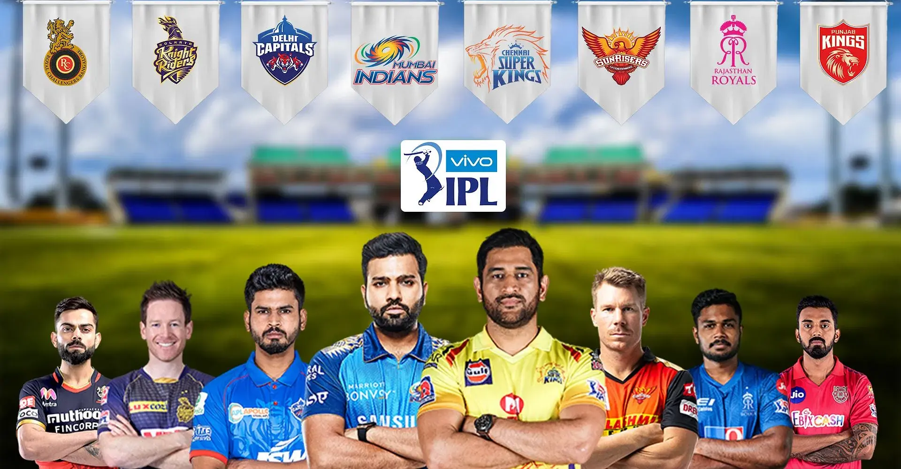

# IPL 2021 Prediction

This repo contains the work me and my team did for IPL 2021 powerplay run prediction competition held by IIT, Madras. Basic machine learning models were used for making predictions about powerplay over score to made given the teams, venue and players.

More details about the competition can be found [here](https://onlinedegree.iitm.ac.in/contest/).

